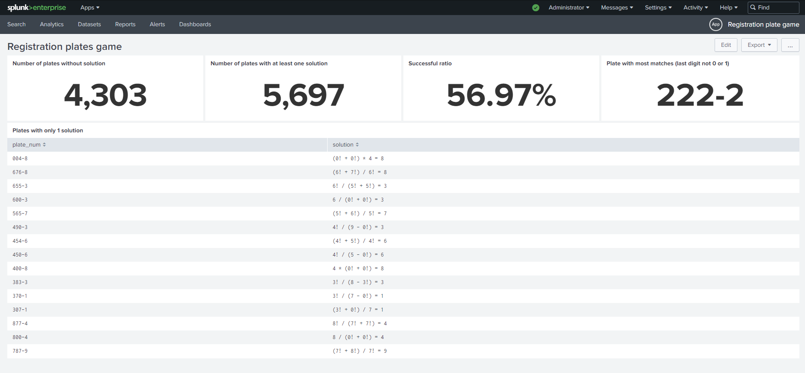

# License Plate Math Game Analysis

This project involves solving the License Plate Math Game, a mental challenge invented by Dorotea during her frequent travels. The game revolves around finding license plate numbers that satisfy a specific mathematical condition: "Using mathematical operations and the first 3 digits of the registration number, obtain the last digit of the registration."

## Project Overview

The primary objective of this project is to create a Python script that performs a comprehensive analysis of the License Plate Math Game. The script calculates various statistics and details of the game, saving the results in a structured CSV file.

## Key Features

The project offers the following features:

1. **Python Script:** A dedicated Python script is developed to analyze the License Plate Math Game.

2. **Solutions Calculation:** The script's core functionality lies in calculating the number of distinct mathematical equations that adhere to the game's rules for each license plate number.

3. **Mathematical Operations:** The script incorporates the following mathematical operations:

   - Addition
   - Subtraction
   - Multiplication
   - Division
   - Factorial
   - Exponentiation
   - Square Root

4. **CSV Output:** The script generates a CSV file that captures the analyzed data, including license plate numbers, potential solutions (if available), and the total number of solutions.

5. **CSV Data Format:** The CSV file's header encompasses the subsequent fields:

   - `plate_num`: The license plate number. When indicated with the "-" sign, the script separates the last digit from the rest. The analysis is confined to 4-digit license plates.
   - `solution`: If a solution exists, the equation is noted. In scenarios involving multiple solutions, any valid equation is included. The textual representation of solutions for mathematical operations follows this convention:
     - Addition: a + b
     - Subtraction: a - b
     - Multiplication: a \* b
     - Division: a / b
     - Factorial: a!
     - Exponentiation: a pow b (read as a to the power of b, i.e., a^b)
     - Square Root: a sqrt b (read as the b-th root of a, i.e., a√b)
   - `total_num`: The aggregate count of feasible game solutions for the given license plate number.

6. **Additional Notes:**

   - The script accounts for parentheses in calculations, ensuring correct representation in the `solution` field.
   - Every digit can be multiplied by -1 or assume a negative value. For instance, a solution for the license plate number 5182 might be expressed as:
     - (-5) - 1 + 8 = 2 (interpreted as 5\*(-1) - 1 + 8)
   - The script is designed to handle edge cases and circumvent calculations involving exceptionally large numbers (e.g., 9!9! that could pose problems in the system).

7. **Bonus Question:**
   Exploring the bonus question involves adapting the code to generate a list of license plates along with a flag indicating the feasibility of reaching the last digit using the game's conditions. Consider optimizations to enhance the script's execution speed for maximum efficiency.

## Splunk Dashboard for License Plate Math Game

In continuation of the project, the analysis extends to creating a Splunk dashboard utilizing the data from the `registration.csv` file. The dashboard offers insights through Splunk searches regarding various aspects of the game's statistics.

## Usage

To utilize the Python script:

1. Clone this repository to your local machine.

2. Navigate to the project directory.

3. Execute the Python script using the command: `python assignment.py`.

4. The script generates two CSV files named `registration.csv` and `registration_bonus.csv`, containing primary and bonus results.

To make use of the Splunk dashboard:

1. Import the `registration.csv` data into Splunk.

2. Construct the dashboard using the provided `dashboard.xml`.
